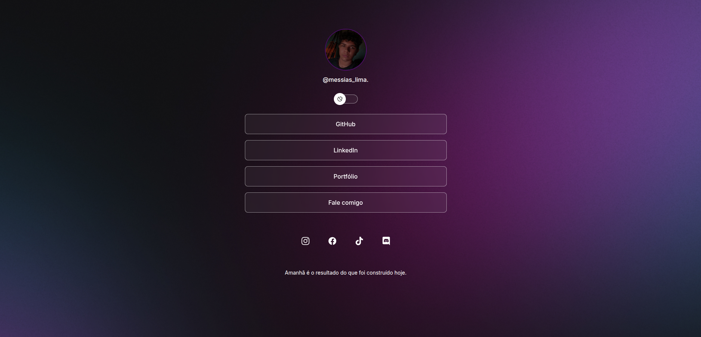

<h1 align="center">Messias Lima — Links</h1>

<p align="center">
  Página pessoal de link in bio: um cartão de visitas digital que reúne meus principais contatos, redes sociais e projetos em um só lugar, com suporte a tema claro e escuro.
</p>

<p align="center">
  <a href="#sobre-o-projeto">Sobre</a>&nbsp;&nbsp;&nbsp;|&nbsp;&nbsp;&nbsp;
  <a href="#funcionalidades">Funcionalidades</a>&nbsp;&nbsp;&nbsp;|&nbsp;&nbsp;&nbsp;
  <a href="#tecnologias">Tecnologias</a>&nbsp;&nbsp;&nbsp;|&nbsp;&nbsp;&nbsp;
  <a href="#como-rodar-o-projeto">Como rodar</a>&nbsp;&nbsp;&nbsp;|&nbsp;&nbsp;&nbsp;
  <a href="#estrutura-do-projeto">Estrutura</a>&nbsp;&nbsp;&nbsp;|&nbsp;&nbsp;&nbsp;
  <a href="#contato">Contato</a>&nbsp;&nbsp;&nbsp;|&nbsp;&nbsp;&nbsp;
  <a href="#licença">Licença</a>
</p>

<p align="center">
  
  
</p>

<br>

<p align="center">
  
</p>

## Sobre o projeto

Este projeto é a minha página de **link in bio**: uma landing page simples e responsiva que centraliza os links mais importantes do meu perfil profissional — GitHub, LinkedIn, redes sociais e canais de contato — em uma única URL, fácil de compartilhar em qualquer lugar (currículo, assinatura de e-mail, bio de redes sociais, etc.).

O foco do projeto foi praticar **HTML e CSS semânticos**, manipulação de tema com **variáveis CSS (custom properties)** e persistência de preferência do usuário com **localStorage**.

## Funcionalidades

- Alternância entre tema **claro** e **escuro**, com a preferência salva no navegador (`localStorage`)
- Detecção automática do tema do sistema operacional na primeira visita (`prefers-color-scheme`)
- Layout responsivo, adaptado para diferentes tamanhos de tela
- Botão de tema acessível via teclado, com `aria-pressed` para leitores de tela
- Lista de links principais e ícones de redes sociais, todos abrindo em nova aba com segurança (`rel="noopener noreferrer"`)

## Tecnologias

Esse projeto foi desenvolvido com:

- **HTML5:** semântico
- **CSS3:** (custom properties, flexbox, media queries)
- **JavaScript:** (vanilla, sem frameworks)
- **Ionicons:** para os ícones de redes sociais
- **Git** e **GitHub:** para versionamento

## Como rodar o projeto

### Pré-requisitos
- Ter o [Git](https://git-scm.com/) instalado
- Um navegador atualizado
- (Opcional) [VS Code](https://code.visualstudio.com/) com a extensão **Live Server**, para hot reload

### Passo a passo

```bash
# clone o repositório
git clone https://github.com/MessiasLim/link-in-bio.git

# entre na pasta do projeto
cd link-in-bio
```

Depois, basta abrir o arquivo `index.html` diretamente no navegador, ou rodar com o Live Server para recarregamento automático a cada alteração.

O projeto também está publicado via **GitHub Pages**:

- [Acesse o projeto online](https://messiaslim.github.io/link-in-bio/)
<!-- TODO: ajuste a URL conforme o nome real do seu repositório -->

## Estrutura do projeto

```
messias-lima-links/
├── assets/
│   ├── avatar.png
│   ├── bg-mobile.jpg
│   ├── bg-mobile-light.jpg
│   ├── moon-stars.svg
│   └── sun.svg
├── index.html
├── style.css
├── script.js
└── README.md
```

## Contato

- GitHub: [github.com/MessiasLim](https://github.com/MessiasLim)
- LinkedIn: [linkedin.com/in/messias-lima](https://www.linkedin.com/in/messias-lima-1685892b5/)
- Instagram: [@messias.lima_](https://www.instagram.com/messias.lima_)

## Licença

Esse projeto está sob a licença **MIT** — sinta-se à vontade para usá-lo como base para o seu próprio link in bio, dando os devidos créditos.

---

Feito por [Messias Lima](https://github.com/MessiasLim)